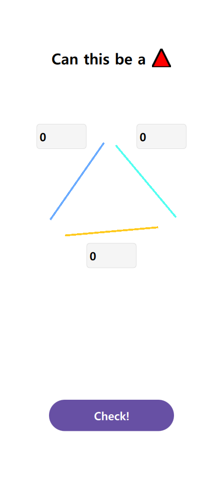

# AI 삼각형 검증기 (AI Triangle Validator)

## 소개

- AI 활용한 소규모 프로토타입 제작

### 목적

- **실험적 접근 :** 간단한 기하학 문제 해결을 소규모 AI 프로젝트화
- **통합 프로덕션 :** 기획-개발-디자인-테스트의 전 과정을 구현
- **지속적 개선 :** 기술 스택과 아키텍처 개선

### 발전

- **1단계 :** Model : 삼각형 검증 AI 모델 개발
- **2단계 :** PyQt 기반 UI 구현
- **3단계 :** 선언형 UI QML로 전환, MVVM 아키텍처 적용 

### 기능

- 삼각형 성립 검증 : 입력 받은 세 변의 길이
- 크로스 체크 : 수학적 방법 (삼각형 부등식)과 AI 모델 예측

## 기술 스택

- **UI :** PyQt/PySide6 → QML (최신 UI/UX)
- **아키텍처 :** 모놀리식 → MVVM 패턴 (유지 보수 및 확장성)
- **배포 :** 로컬 → Docker, PyInstaller 지원 준비 중 (다양한 환경 지원)

### 시각화




<details>
<summary>AI 모델 개발 과정 (Click)</summary>

### 데이터셋

*   **생성 방법 :** 세 변의 길이로 구성된 OK/NG 삼각형 데이터를 1,000,000개씩 생성
*   **데이터 형식 :** (3, 1) 형태의 NumPy 배열
*   **전처리 :** StandardScaler 사용하여 정규화

### 모델 구조

*   **종류 :** Sequential
*   **입력층 :** Flatten layer (3, 1) 배열을 1차원으로 펼침
*   **은닉층 :** Dense layer (64개 노드, ReLU 활성화 함수)
*   **출력층 :** Dense layer (1개 노드, Sigmoid 활성화 함수)

### 학습 과정

*   **손실 함수 :** Binary Cross-Entropy
*   **옵티마이저 :** Adam
*   **학습 횟수 (Epochs) :** 8

### 모델 학습 코드

```python
def gen_triangle_sides(num_samples):
    success_cases = []
    fail_cases = []
    success_cnt = 0
    fail_cnt = 0

    while True:
        # 세 변의 길이를 랜덤으로 생성
        three_sides = np.random.randint(MIN_LEN, MAX_LEN, INPUT_SHAPE)

        # 가장 긴 변 < 나머지 두 변의 합 : 성공
        if is_valid_triangle(three_sides):
            if success_cnt < num_samples:
                success_cases.append(three_sides)
                success_cnt += 1
        else:
            if fail_cnt < num_samples:
                fail_cases.append(three_sides)
                fail_cnt += 1

        if success_cnt == num_samples and fail_cnt == num_samples:
            break

    return np.array(success_cases), np.array(fail_cases)

def is_valid_triangle(three_sides):
    max_len = max(three_sides)
    others_len = sum(three_sides) - max_len
    return True if others_len > max_len else False

# 데이터 생성 및 모델 학습
num_samples = 1000000
success_cases, fail_cases = gen_triangle_sides(num_samples)

# 데이터 정규화
scaler = StandardScaler()
norm_success_cases = scaler.fit_transform(success_cases.reshape(-1, 3)).reshape(-1, 3, 1)
norm_fail_cases = scaler.fit_transform(fail_cases.reshape(-1, 3)).reshape(-1, 3, 1)

# 데이터 결합 및 레이블 생성
triangles = np.concatenate([norm_success_cases, norm_fail_cases])
labels = np.concatenate([np.ones(num_samples), np.zeros(num_samples)])

# 모델 생성 및 학습
model = models.Sequential([
    layers.Flatten(input_shape=(3, 1)),
    layers.Dense(64, activation='relu'),
    layers.Dense(1, activation='sigmoid')
])

model.compile(optimizer='adam', loss='binary_crossentropy', metrics=['accuracy'])
model.fit(triangles, labels, epochs=8)
```

</details>
