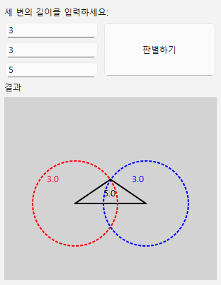
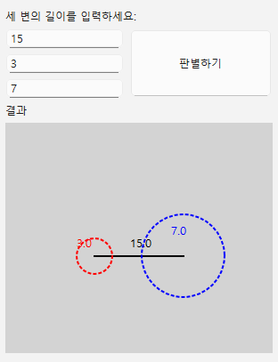

## 삼각형 판별 AI 모델

삼각형의 세 변이 주어졌을 때, 그 세 변으로 삼각형을 만들 수 있는지 예측하는 AI 모델을 구현

## (준비중) exe 실행 파일로 사용하는 방법

## (준비중) 도커 이미지 파일로 실행하는 방법

## 요구사항

- Python 3.10.11 (pyenv로 관리)
- numpy
- tensorflow
- scikit-learn

## 데이터셋

*   **생성 방법:** `gen_triangle_sides` 함수를 사용하여 유효한 삼각형과 유효하지 않은 삼각형의 데이터를 각각 1,000,000개씩 생성. 각 데이터는 세 변의 길이로 구성.
*   **데이터 형식:** (3, 1) 형태의 NumPy 배열
*   **전처리:** 데이터는 StandardScaler를 사용하여 정규화.

## 모델 구조

*   **모델 종류:** Sequential 모델
*   **입력층:** Flatten layer (3, 1) 형태의 입력을 1차원 배열로 펼침
*   **은닉층:** Dense layer (64개 노드, ReLU 활성화 함수)
*   **출력층:** Dense layer (1개 노드, Sigmoid 활성화 함수)

## 학습 과정

*   **손실 함수:** Binary Cross-Entropy
*   **옵티마이저:** Adam
*   **학습 횟수 (Epochs):** 8

## 설치 방법

1. `pyenv`로 프로젝트에 사용할 Python 버전 설정:
    (pyenv에 python을 설치해야 사용 가능)

    ```bash
    pyenv local 3.10.11
    ```

2. 가상환경 생성

    ```bash
    python -m venv .venv
    ```

3. 가상환경 활성화 (Windows)

    ```bash
    .\venv\Scripts\activate
    ```

4. 필요한 라이브러리 설치

    ```bash
    pip install --upgrade pip
    pip install numpy
    pip install tensorflow
    pip install scikit-learn
    ```

## 사용 방법

1. Jupyter Notebook에서 실행. 아래는 필수 라이브러리와 모델 설정하는 코드

    ```python
    !"{sys.executable}" -m pip install --upgrade pip
    !"{sys.executable}" -m pip install numpy
    !"{sys.executable}" -m pip install tensorflow
    !"{sys.executable}" -m pip install StandardScaler
    ```

    ```python
    import sys
    import numpy as np
    import tensorflow as tf
    from tensorflow.keras import layers, models
    from sklearn.preprocessing import StandardScaler

    MIN_LEN = 1 # 최소 길이
    MAX_LEN = 1000 # 최대 길이
    INPUT_SHAPE = (3, 1)
    ```

2. 성공/실패 케이스를 각각 `num_samples` 갯수만큼 생성하는 함수

    ```python
    def gen_triangle_sides(num_samples):
        success_cases = []
        fail_cases = []
        success_cnt = 0
        fail_cnt = 0

        while True:
            # 세 변의 길이를 랜덤으로 생성
            three_sides = np.random.randint(MIN_LEN, MAX_LEN, INPUT_SHAPE)

            # 가장 긴 변 < 나머지 두 변의 합 : 성공
            if is_valid_triangle(three_sides):
                if success_cnt < num_samples:
                    success_cases.append(three_sides)
                    success_cnt += 1
            else:
                if fail_cnt < num_samples:
                    fail_cases.append(three_sides)
                    fail_cnt += 1

            if success_cnt == num_samples and fail_cnt == num_samples:
                break

        return np.array(success_cases), np.array(fail_cases)

    def is_valid_triangle(three_sides):
        max_len = max(three_sides)
        others_len = sum(three_sides) - max_len
        return True if others_len > max_len else False
    ```

3. 데이터를 생성하여 모델 학습에 사용

    ```python
    num_samples = 1000000
    success_cases, fail_cases = gen_triangle_sides(num_samples)
    ```

4. 데이터 정규화

    ```python
    scaler = StandardScaler()
    norm_success_cases = scaler.fit_transform(success_cases.reshape(-1, 3)).reshape(-1, 3, 1)
    norm_fail_cases = scaler.fit_transform(fail_cases.reshape(-1, 3)).reshape(-1, 3, 1)
    ```

5. 성공/실패 케이스 결합 및 레이블 생성

    ```python
    triangles = np.concatenate([norm_success_cases, norm_fail_cases])
    labels = np.concatenate([np.ones(num_samples), np.zeros(num_samples)])
    ```

6. 모델 생성과 학습

    ```python
    model = models.Sequential([
        layers.Flatten(input_shape=(3, 1)),
        layers.Dense(64, activation='relu'),
        layers.Dense(1, activation='sigmoid')
    ])

    model.compile(optimizer='adam', loss='binary_crossentropy', metrics=['accuracy'])

    model.fit(triangles, labels, epochs=8)

    loss, accuracy = model.evaluate(triangles, labels)
    print(f'Test Accuracy: {accuracy}')
    ```

7. 예측 테스트

    ```python
    example = np.array([1, 2.1, 1])
    single_traiangle_coors = np.array([example])
    predictions = model.predict(single_traiangle_coors)
    predictions # 예측 결과 출력 (0에 가까울수록 False 1에 가까울수록 True)
    ```

## 결과 시각화



